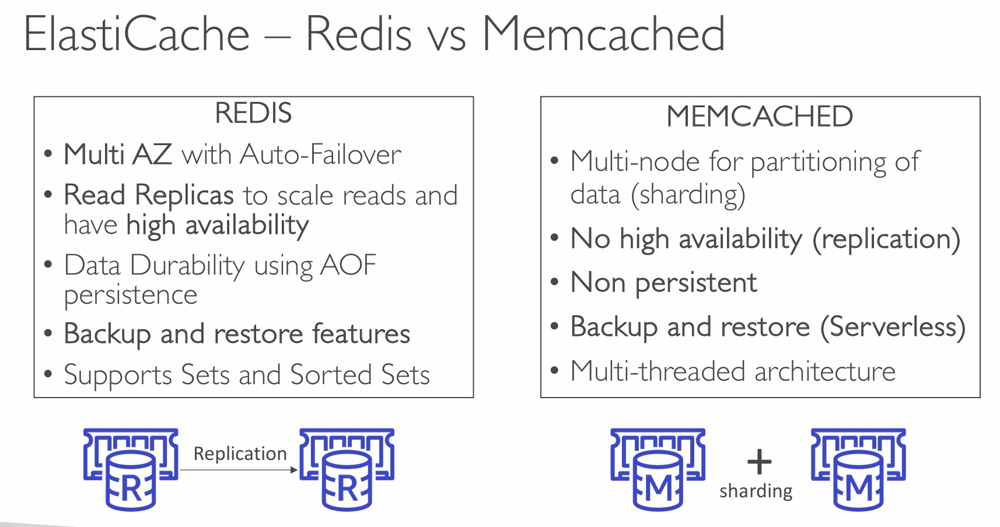
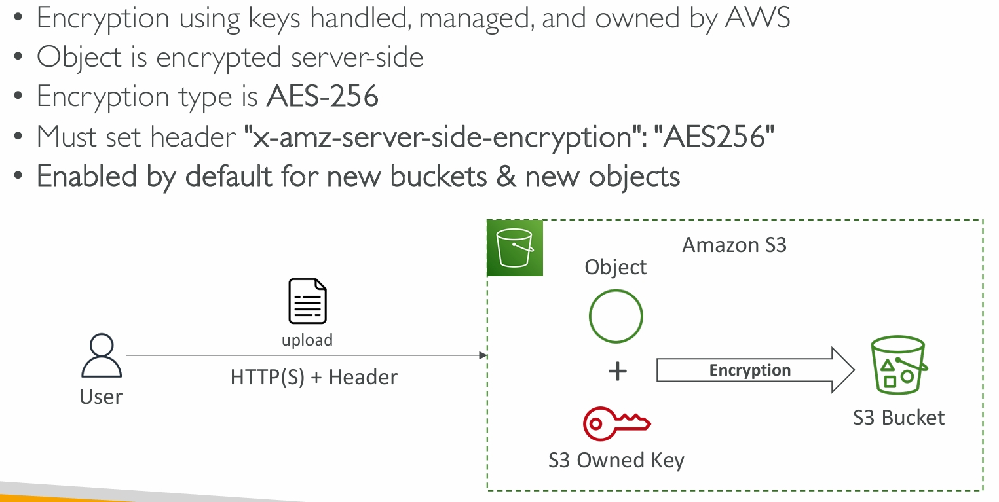
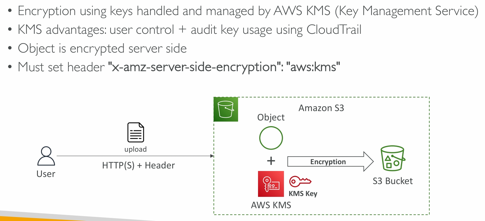
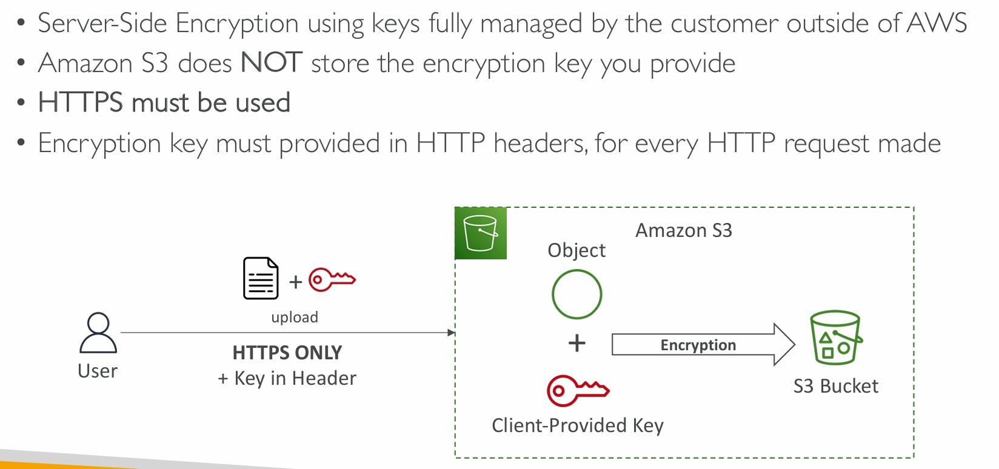
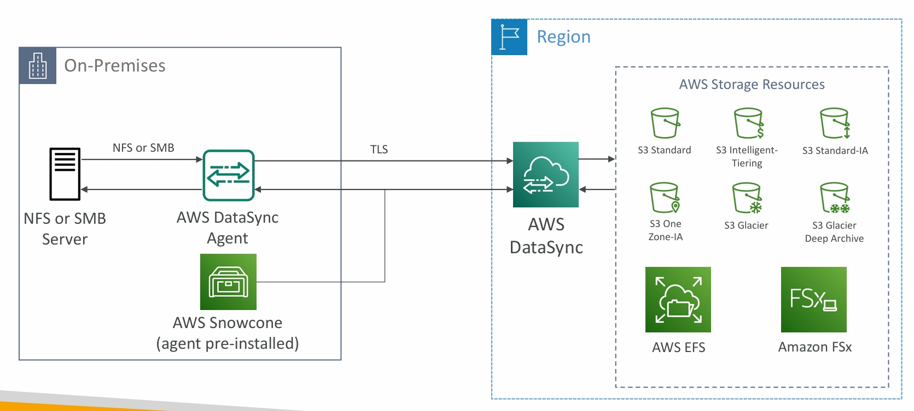

### How is EC2 used to architect a cloud solution?

==== **Solutions Architect Associate Udemy** ============================
#### Placement group
* **cluster** -clusters instances into a low-latency group in a **single Availability Zone**
    * Great network (10 Gps bandwidth between instances with Enhanced Networking enabled - recommended)
    * **Single point failure**
    * Use case
        * Big Data job that needs to complete fast
        * Application that needs extremely low latency and high nework throughput
* **spread** - spreads instances across underlying hardware (max 7 instances per group per AZ)
    * can span across multiple AZs in the same region
    * reduce the rick of simultaneous failure
    * EC2 are on different physical hardware
    * Use case
        * applciation that needs high availablility
        * critical applications where each instance must be isolated from failure from each other
* **partition** - spreads instances across many different partitions (which rely on different sets of racks) within an AZ. Scales to 100s of EC2 instances per group (Hadoop, Cassandra, Kafka)
    * can span across multiple AZs in the same region
    * A partion failure can affect many EC2s but won't affect other partitions.
    * Use case:
        * HDFS, HBase, Cassandra, Kafka

#### Elastic Network Interface (ENI)
[ENI link](https://aws.amazon.com/blogs/aws/new-elastic-network-interfaces-in-the-virtual-private-cloud/)

* attached to one AZ

Good for failover -> reattach to a different instance

#### EC2 Hibernate
* stop
    * the data on the disk (EBS) is kept **intact** in the next start
* terminate
    * any EBS volumes (root) also setup to be **destroyed** is lost

#### To enable EC2 Hiubernate, the EC2 instance Root Volume type must be an EBS volume and must be encrypted to ensure the protection of sensitive content.
Use case:
* Services that takes time to initialize
* Long-running job
* Saving the RAM state

### EC2 Storage

* EBS Volume Types
    * SSD - general - gp2 / gp3
        * good for developemt and test environment
    * High-performance SSD - **Provisioned IOPS SSD volumes** - io1/io2
        * good for database workloads (sensitive to storage perf)
    * low cost HDD - **Throughput Optimized HDD volumes** - stl
        * good for big data, data warehousing, log processing
    * lowest cost HDD - cold HDD volumes - scl
        * good for lowest cost storage is important
    * **Only gp2/gp3 and io1/io2 can be used as boot volumes**

* EBS multi- Attach - only for **io1/io2 family**
    * attach the same EBS to multiple EC2 in the same AZ
    * **Up to 16 EC2 instances at a time to the same volume**
    * applications must manage **concurrent** write operations

* EBS Encryption
    * encrypt an unencrypted EBS volume
        * Create a snapshot of the volume
        * Encrypt the snapshot **(copy snapshot allows encryption)**
        * create a new EBS volume from the snapshot (the volume will be also be encrypted)
        * attach the new EBS volume to the original instance
    * or create EBS volume from unencrypted snapshot by choosing "Encrypt this volume"

* EFS - Elastic File System
    * managed NFS (network file system) that can be mounted on manyEC2
    * EFS works with EC2 instances in multi-AZ
    * Highly available, scalable, expensive (3x gp2), pay per use
    * **compatible with Linux based AMI (not Windows)**
    * Use case
        * content management, web serving, data sharing, Wordpress
    * Use Lifecycle policy to control **storage tiers**
        * standard
        * infrequent access (EFS - IA)
        * archive
    * Performance settings
        * Bursting - basic performance
        * Elastic - unpredictable I/O, automatically adjust
        * Provisionsed - customaize the throughput and pay for it

* AMI (Amazon Machine Image) - a **customization** of EC2 Instance
    * launch option
        * public AMI: AWS provided
        * your own AMI: you make and maintain them yourself
        * AWS Marketplace AMI: someone else make and sell
    * AMIs are built for a specific AWS region, they are unique for each AWS region. Can't launch EC2 insatnce with the AMI in another region, but can copy the AMI to the target region.

* EC2 Instance Store
    * EBS volumes are network drives with good but "limited" performance
    * If neeed **high-performance** hardware disk, use EC2 Instance Store
        * BetterI/O performance
        * it loses storage if it's stopped
        * Good for buffer/cache/scratch data/temprary content
        * risk of data loss if hardware fails
        * Backups and Replication are your responsibility

#### Scalability & High Availability

* Elastic Load Balancer is a managed load balancer
    * AWS guarantees it will be working
    * AWS takes care of upgrades, maintance, high availablity
    * AWS provides only a few configuration options
    * 4 kinds of managed load balancers
        * Application LB: HTTP HTTPS, WebSocket
        * Network LB: TCP, TLS(secure TCP), UDP - ultra high performance
        * Gateway LB: Operates at network layer - IP protocol
        * not used - Classic LB

* Application LB
    * is great for **micro servicews & container-based application** - Docker & Amazon ECS
    * static DNS name
    * supports redirects (from HTTP to HTTPs)
    * routing table to different target groups
        * URL
        * hostname
        * Query String. Headers
    * The instances can only see the private ip address of the ALB, to get the client's ip addresses, ALB adds a header called **X-Forwarded-For**

* Network LB - ultra high performance
    * it has **one static IP per AZ**, and supports assigning Elastic IP, also a static DNS name
    * target groups
        * EC2 instances
        * **private** IP address
        * Application Load balancer
    * **Health check support TCP, HTTP and HTTPS Protocols**

* Gateway Load Balancer
    * **GENEVE protocol on port 6081**
    * target groups
        * EC2 instances
        * **private** IP address
    * 

* ELB - sticky Sessions
    * This works with **ALB and NLB**
    * Use case:
        * make sure the user does not lose his session data
    * Cookie name
        * for custom cookie: **DONOT use ALB APP/ALB/ALBTG**
        * Application-based cookie
            * custom cookie - generated by the target
            * application cookie - generated by the load balancer **AWS ALB APP**
        * duration-based cookie
            * generated by load balancer **AWS ALB**

* ELB - Cross-Zone LB
    * 
    * by default, enabled for ALB
    * by default, disabled for NLB and Gateway LB

* ELB - SSL/TLS
    * An SSL cetificate allows traffic between your clients and your load balancer to be encrypted in transit (in-flight encryption)
    * SSL - Secure Sockets Layer
    * TLS - Transport Layer Security, newer version
    * **SNI Sserver Name Indication**
        * solves the problem of loading multiple SSL certificates onto one web server

* **Deregistration Delay (ALB/NLB)** - Connection draining (CLB)
    * it give some time for your instances to complete the "in-flight requests" while the instance is de-registered or unhealthy
    * 

* Auto Scaling Group
    * Scale out (add EC2 instances) to match increased load
    * Scale in (remove EC2 instances) to match decreased load
    * Ensure having a minimum and max number of EC2 instace
    * Automatically register new instances to a load balancer 
    * Re-create an EC2 instance in case the previous one is terminated (unhealthy)
    * Free
    * **Launch Template**
        * AMI + instance type
        * EC2 User data
        * EBS Volume
        * Security Groups
        * SSH Key pair
        * IAM roles for the EC2 instances
        * Network + subnet information
        * Load balancer information
        * min/max size/initial capacity

* ASG policies
    * Dynamix Scaling
        * Target Tracking Scaling
            * example: want the average ASG CPU to stay around 40%
        * Simple/Step Scaling
            * example: when a cloudwatch alarm is trigger (CPU > 70%) add 2 new units, or remove.
    * Scheduled Scaling
        * example: increase the min capacity to 10 at 5 pm on Fri
    * Predictive Scaling
        * continusly forcast load and schedule scaling ahead

#### RDS - Relational Database Service

* Advantage versus deploying DB on EC2
    * Automated provision, OS patching
    * Continuous backups and Point in time restore
    * monitoring dashboards
    * Read replicas for improved read performance
    * Multi AZ setup for Disaster Recovery
    * Maintenance windows for upgrades
    * Scaling capability vertical and horizontal
    * Storage backed by EBS
    * **BUT you cant ssh into your instance**

* RDS - Storage Auto Scaling
    * automatically increase storage
    * have to set **Max storage threshold**
    * useful for upredicatable workloads
    * supports all database engine

* RDS Read replica vs RDS Multi-AZ(standby)
    * up to 15 RRs
    * within AZ, Cross AZ or Cross region
    * Replication is **ASYNC**, so reads are eventually consistent
    * RR can be promoted to their own DB
    * **update SQL connection String**
    * Network cost
        * for RDS RR in the same region different AZ, free
        * for cross region, cost money
    * RDS Multi AZ - standby (comparison with RR)
        * **SYNC** replication, different from RR
        * One DNS name - failover to standby
        * no manual work
        * RR can be setup as Multi AZ for Disaster Recovery
        * From Single-AZ to Multi-AZ
            * Zero Down time
            * just click "modify" for the database

* RDS Backups
    * Automated backups
        * daily full backup
        * transaction logs are backed-up every 5 mins
        * 1-35 days of retention set 0 to disable sutomated backups
    * Manual DB snapshots
        * manually triggered
        * retention of backup for as long as you want
    * trick: in a stopped RDS databse, you will still pay for the storage. If you plan on stopping it for long time, you should snapshot & restore instead.
* Aurora Backups
    * only difference
        * for automated backups
            * 1 to 35 days (**can't** be disabled)

* RDS & Aurora Restore ptions
    * Restoring a RDS / Aurora backup or a snapshot
    * Restoreing MySQL RDS databse from s3
        * create a backup of your on-premises database
        * store it on S3
        * restore the backup file onto a new RDS instance running  MYSQL
    * Restoring MySQL Aurora cluster from S3
        * create a backup of your on-premises using **Percona XtraBackup**
        * store the backup file on S3
        * restore the backup file onto a new Aurora cluster running  MYSQL

* Aurora Database cloing
    * faster then snapshot & restore
    * use copy-on-write protocol
    * without impact on production database

* **Amazon Aurora**
    * can support both MySQL and Postgres
    * Aurora storage automatically grows 10GB to 256TB
    * support for cross region replication
    * Aurora Replicas - Auto Scaling
        * if the average CPU usage increase, then auto add more RR and Reader Endpoint auto extended to cover the newly added RRs
    * Custom Endpoint replcace for Reader Endpoint
    * Aurora Serverless
        * good for infrequent unpredictable
        * no capacity planning needed
    * **Global Aurora Database**
        * **Typical cross-region replication takes less than 1 second**
    * Babefish
        * allows Aurora postgreSQL to understand commands targeted for MS SQL server

* Amazon RDS Proxy
    * Improving database effiency by reducing the stress on database resources (CPU & RAM) and minimize open connections and timeouts
    * Reducing RDS & Aurora failover time by up 66%
    * RDS Proxy is never publicly accessible (must be accessed from VPC)
    * helpful for lambda functions
    * Enforce IAM Authentication for DB, and securely store crendentials in AWS Secrets Manager

* ElastiCache
    * get managed Redis or Memcached
    * in-memory
    * helpful for **read intensive workloads**
    * **involves heavy application code changes**
    * 
    * 
    * supports **IAM Authentitation for Redis**
    * **Redis AUTH**
    * Redis use case
        * **Redis Sorted sets** for gaming leaderboards

* **important ports VS RDS databases ports**
    * important
        * FTP: 21
        * SSH: 22
        * SFTP: 22 (same as SSH)
        * HTTP: 80
        * HTTPS: 443
    * RDS
        * PostgreSQL: 5432
        * MySQL: 3306
        * Oracle RDS: 1521
        * MSSQL Server: 1433
        * MariaDB: 3306 (same as MySQL)
        * Aurora: 5432 (if PostgreSQL compatible) or 3306 (if MySQL compatible)

### Route 53
* Hosted Zones
    * pay for each zone per month

* CNAME vs Alias
    * CNAME
        * points a hostname to any other hostname
        * **only for non root domain**
    * Alias
        * points a hostname to an AWS Resources
        * **works both root domain and non root domain**
        * **always** a type of AAAA/A
        * can't saet TTL
        * cannot set an Alias record for an EC2 DNS name

* Route 53 policies
    * Simple
        * If multiple values returned, choose a random one
        * **can't** be associated with Health Check
    * Weighted
        * control the % of the requests that go to each specific resources
        * if a record set weight as 0, stop sending traffic to this
        * If all records set weight as 0, all resources returned equally
    * Failover (Active-Passive)
    * Latency based
        * Latency is based on **traffic** between users and AWS Regions
        * **can** be associated with Health check
    * Geolocation
        * **can** be associated with Health Check
        * is based on user **location**
        * should create a "default" record
        * use case:
            * website localization
            * restrict content distribution
            * load balancing
    * Multi-Value
        * **can** be associated with Health Check
        * **not** a subsitiude for an ELB, as it's at client side
        * return up to 8 healthy records
    * Geoproximity (need to enable Traffic flow feature)
        * shift more traffic to resources based on defined **bias**
    * IP-based
        * provide a list of CIDRs for your clients
        * use case:
            * optimize performance
            * reduce network cost
        * example:
            * route end users from a particular ISP to a specific endpoint

* If buy your domain on 3rd party registrar, can still use Route 53 as DNS Service provider
    1. create a Hosted Zone in Route 53
    2. Update NS records on 3rd party website to use Route 53 Name Servers

* Route 53 Health Check
    * HTTP Health Checks are only for public resources
    * Calculated Health Checks
        * performaing maintenance to your website without causing all health checks to fail
    * for **private hosted zones**
        * Route 53 health checkers are outside the VPC, they **cannot** access the **private** endpoints
        * Use **CouldWatch Metric** and associate a **CloudWatch Alarm**

* Route 53 & Hybrid DNS
    * 
    * 

#### Solution Architecture discussion
* How to initiate EC2 instance quickly
    * Use a Golden AMI: install beforehand, launch instance with it
    * Bootstrap with User Data
    * Hybrid: mix Golden AMI and User Data (**Elastic Beastalk**)
* Elastic Beanstalk
    * A free managed serivew for developers to depoly applications.

### S3

* Buckets
    * must have **globally unique name**
    * created in a region
* Objects
    * the key is the FULL path
    * the key is the compose prefix and object name
    * max objedct size is 5T, otherwise need multi-part upload
* Version
    * enable at bucket level
    * after versioning, the existed files are versioned as **null**
    * suspend versioning does not delete previous versions

* S3 replication
    * CRR (cross region)
        * compliance, lower latency access, replication across accounts
    * SRR (same region)
        * log aggregation, live replication between production and test accounts
    * after enabled
        * only **new objects** will be replicated
        * replicate **existed** objects, using **S3 batch replication**
    * for **delete** operations
        * delete markers can be replicated
        * delete with version ID is replicated
    * **no chaining of replication**

* **S3 storage classes**
    * Standard General purpose
        * 99.99 availability
        * for frequently accessed data
        * low lantency and high throughput
        * sustain 2 concurrent facility failures
        * use case
            * big data analytics
            * mobile & gaming application
            * content distribution
    * Infrequent Access
        * less frequently access, but requires rapid access when needed
        * S3 standard-IA
            * 99.9 ava
            * for disaster recovery, backups
        * S3 One Zone-IA
            * 99.5 ava
            * for secondary backup copies of on-premise data, or data you can recreate
    * Glacier Storage
        * low cost for archiving/backup
        * Glacier instant retrieval
            * millisecond retrieval, great for data accessed once a quater
            * minimum storage duration 90 days
        * Glacier flexible retrieval
            * expedite 1-5 mins, standard 3-5 hous, bulk 5-12 hours
            * minimum storage duration 90 days
        * Glacier deep archive
            * standard 12 hours, bulk 48 hours
            * minimum storage duration 180 days
    * S3 intelligent Tiering
        * small monthly monitoring and auto-tiering fee
        * move objects automatically between Access Tiers based on usage
        * no retrieval charges
    * **S3 Express One Zone**
        * **single availablity Zone storage class**
        * data stored in **Directory Bucket (bucket in a single AZ)**
        * 10x better than s3 standard 50% lower cost
        * use case
            * latency-sensitive apps, data intensive apps. AI&ML training, HPC (high performace computing)
    * comparison
        * 

    * price example
        * 

* S3 Lifecycle Rules (with S3 Analytics)
    * Transaction Actions - move objects to another storage class
        * move objects to Standard IA class 60 days after creation
        * move to Glacier for achiving after 6 months
    * Expiration Actions - configure objects to expire (delete) after some time
        * Access log file can be set to delete after 365 days
        * **Can be used to delete old verions of files (if version is enabled)**
        * Can be used to delete incomplete Multi-Part uploads
    * Rules can be created for a **certain prefix e.g. s3://mybucket/mp3/\***
    * Rules can be created for **certain objects Tags e.g. Department: Finance**
    * **S3 analytics does not work for One-Zone IA or Glacier, only work for standard and Standard IA**

* **S3 Requester Pays**
    * In general, bucket owner pays for all S3 storage and **data transfer**
    * **With Requester Pays Bucket**, the requester pays the cost of the request
        * The requester must be authenticated in AWS (cannot be anonymous)

* S3 Event Notifications
    * IAM Permissions
        * for SNS, SQS, Lambda Function, use **resource access policies**
        * EventBridge is the fourth, advanced filtering, multiple destination.

* S3 Performance improvement
    * Multi-Part upload
        * recommand for files > 100MB, must use for files > 5GB
        * it parallelize uploads to speed up
    * S3 Transfer Acceleration
        * Increase transfer speed by transfering file to an **AWS edge location which will forward the data to S3 bucket**
        * **compatible with multi-part upload**
    * S3 Byte-Range Fetches
        * can be used to speed up downloads
        * can be used to retrieve only partial data
    
* S3 Batch Operations
    * **Encrypt un-encrypted objects**
    * You can use **S3 inventory** to get object list and use **Athena** to query and filter your objects, then pas it to **Batch Operation** to do the work.

* S3 Storage Lens
    * used to understand, analyze and optimize **storage** across entire **AWS Organization**.
    * 
    * **default dashboard has data across multiple accounts and multiple regions**
    * **Free Metrics**
        * available for all users
        * data available for queries for **14 days**
    * **Advanced Metrics**
        * Activity, Advanced Cost Optimization, Advanced Data Protection, Status Code
        * CloudWatch Publishing
        * Prefis Aggregation
        * data available for queries for **15 months**

### S3 Security
* S3 Object Encryptyion
    * Server-Side Encryption (SSE)
        * Server-Side Encryption with Amazon S3-Managed Keys (**SSE-S3**) - Enabled by Default
            * 
        * Server-Side Encryption with KMS Keys stored in AWS KMS (**SSE-KMS**)
            * 
            * It has limitations for speed - KMS quota per sec
        * Server-Side Encryption with Customer-Provided Keys (**SSE-C**)
            * 
    * Client-Side Encryption
        * 
    * Encryption in transit (SSL/TLS)
        * S3 exposes **HTTP and HTTPS**
        * **HTTPS is mandatory for SSE-C**
        * Use **bucket policy** to force encryption in transit and evaluated before **default encryption**

* **CORS Cross-Origin Resource Sharing**
    * web browser security that allows you to enable files being retrieved from one S3 bucket in case the request is originating from another origin
    * Origin = scheme (protocol) + host (domain) + port
    * **If a client makes a cross-origin request on S3 bucket, need to enable the correct CORS headers**
        * you can allow for a specific origin or for *(all origins)

* **S3 - MFA Delete**
    * **only the bucket owner (root account) can enable/disable MFA Delete**
    * To use it, **Versioning must be enabled** on the bucket
    * MFA **will be required** to
        * Permanently delete an object version
        * suspend versioning on the bucket
    * MFA **won't be required** to
        * enable versioning
        * list deleted versions

* S3 Access Logs
    * Warning
        * **Dont set your logging bucket to be the monitored bucket**, otherwise pay a lot

* S3 - Presigned URLs
    * allow temporary access of GET/PUT on S3 bucket for an external user without breaking your security
        * S3 Console - 1 min to 12 hours expiration
        * AWS CLI - default 3600 sec, max 168 hours expiration

* **S3 Glacier Vault Locck & S3 Object Lock**
    * WORM (Write once read many)
    * glacier lock
        * create a Vault Lock Policy
    * Object lock
        * **versioning must be enabled**
        * retention mode - **compliance**
            * Object versions **can't be overwritten or deleted by any user, including the root user**
            * Objects retention modes **can't be changed, and retention periods can't be shortened**
        * rentention mode - **governance**
            * Some users have special permissions to change the retention or delete the object. change lock settings
        * **Legal Hold**
            * protect the object **indefinitely**
            * can be modified by IAM permission

* S3 - Access Points
    * 
* S3 Object Lambda use case
    * **Redacting personally identifiable information** for analytics or non production environments.
    * Converting across data formats, such as converting XML to JSON.
    * Resizing and watermarking images on the fly using caller-specific details, such as the user who requested the object.

#### CloudFront and Global Accelerator

* CloudFront
    * **CDN**
    * **Improves read performance, content is cached at the edge**
    * DDoS protection, integration with Shield, AWS Web Application Firewall
    * **Geo Restriction to limit IP**
    * **Cloud Front vs S3 Cross Region Replication**
        * CloudFront:
            * Global Edge network
            * Files are cached for a TTL (maybe a day)
            * **Great for static content that must be available everywhere**
        * S3 CRR
            * Must be setup for each region you want replication to happen
            * Files are updated in near real-time
            * Read only
            * **Great for dynamic content that needs to be available at low-latency in few regions**
    * **Pricing class**
        1. Price Class All: all regions – best performance 
        2. Price Class 200: most regions, but excludes the most expensive regions
        3. Price Class 100: only the least expensive regions
        * 
    * **Global Accelerator vs CloudFront**
        * same
            * They both use the AWS global network and its edge locations around the world
            * Both services integrate with AWS Shield for DDoS protection
        * different
            * CloudFront
                * Improves performance for both cacheable content
                * Dynamic content (such as API acceleration and dynamic site delivery)
                * Content is served at the edge
            * Global Accelerator
                * Improves performance for a wide range of applications over TCP or UDP
                * Proxying packets at the edge to applications running in one or more AWS Regions
                * Good fit for non-HTTP use cases, such as gaming (UDP), IoT (MQTT), or Voice over IP
                * Good for HTTP use cases that **require static IP addresses**
                * Good for HTTP use cases that **required deterministic, fast regional failover**

#### AWS Storage Extras

* AWS Snowball
    * Highly-secure, portable **devices** to collect and process data at the edge, and migrate data into and out of AWS
        * Storage optimized device has 210 TB SSD
        * Compute optimized device has 28 TB SSD
        * **Both have the same cpus and memory**
        * **If it takes more than a week to transfer over the network, use Snowball devices**
        * **Snowball cannot import to Glacier directly**
            * import to S3 first, then use S3 lifecycle policy

* **Amazon FSx**
    * **luanch 3rd party high-performance file systems on AWS**
    * FSx for Windows
        * support **SMB**
        * Can be mounted on **Linux EC2 Instance**
        * support **Microsoft's Distributed File System (DFS) Namespaces**
        * Can be **accessed** from your on-premises infrastructure (VPN or Direct Connect)
        * **Multi-AZ (high availability)**
        * Data is backed-up daily to S3
    * FSx for Lustre
        * **High Performance Computing (HPC)**
        * **Seamless integration with S3**
            * can read S3
            * can write output of the computations back to S3
        * Can be **used** from on-premises servers (VPN or Direct Connect)
        * File System Deployment Options
            * **Scratch File System**
                * Temporary storage
                * Data is not replicated
                * High burst
                * used for optimized cost
            * **Persistent File System**
                * Long-term storage
                * Data is replicated within **same AZ**
                * used for sensitive data
    * FSx for NetApp ONTAP/NAS
        * **compatible with NFS, SMB, iSCSI protocol**
        * **Point-in-time instantaneous cloning**
    * FSx for OpenZFS
        * **compatible with NFS**
        * **Point-in-time instantaneous cloning**

* AWS Storage Gateway
    * **Hybrid cloud**, a bridge between on-premises data and cloud data
    * File Gateway - NFS/SMB
        * **most recently used data is cached in the file gateway**
        * **lifecycle policy to s3 Glacier**
    * Volume Gateway - iSCSI
        * **Cached volumes**: low latency to **most recent data**
        * **Stored volumes**: **entire dataset** is on premse, scheduled backups to S3
    * Tape Gateway - iSCSI VTL (virtual tap library)
    * 

* AWS Transfer Family
    * only use **FTP/FTPS/SFTP** to transfer to S3
    * 

* AWS DataSync
    * **File permissions and metadata are preserved**
    * can synchronize between anything
    * **need to run the DataSync agents if connecting to an NFS or SMB server**
    * snowcone is with DataSync pre-installed
    * 

### Message Queue

* SQS - queue model - standard
    * used to **decouple applications**, used as buffer
    * default duration is 4 days upto 14 days
    * size upto 1024 KB
    * can have duplicate messages - at least once delivery
    * can have out of order message
    * **SQS with AScalingG**, CloudWatch metric/alarm - use Queue Length to scale the instances
        * to avoid EC2 instances overwhelm the database
    * Encryption
        * in-flight with HTTPS API
        * at-rest with KMS
        * client side
    * Access Control: IAM policies
    * SQS Access Policies
        * for corss-account access
        * to allow other services to write to an SQS queue
    * **Message Visibility Timeout**
        * if a message used by a consumer will have **30 sec** invisible time before it's visible again
        * call **changeMessageVisility** API to get more time
    * **Long polling**
        * **it decreases the number of API calls made to SQS while increasing the efficiency and reducing latency of your application**
        * use WaitTimeSeconds to set the time that consumer needs to wait, 20 secs prefered
    * **FIFO Queue**
        * the message is **ordered different from standard**
        * limited throughput: 300 msg/s without **batching**, 3000 msg/s with

* SNS - publish/subscribtion model
    * each subscribe to this will get **all messages**
        * example of subscriber could be SQS
        * many AWS services can send data to SNS
    * security is the same as SQS
    * use **filter** to filter messages
* SNS and SQS - Fan Out pattern
    * example: S3 only allow one event notification
        * S3 -> SNS -> multiple SQS and/or Lambda 

* Kinesis data streams - **real-time** streaming model
    * Collect and store streaming data
    * retention is between 365 days
    * data can't be deleted
    * data up to 1MB
    * Capacity Modes
        * Provisioned mode: choose num of **shards**
        * On-demand mode

* Amazon Data Firehose - **Near Real-Time**
    * send data from src to des
    * no torage
    * 

* 

* Amazon MQ
    * use **EFS** for HA
    * used to support open protocols when **migrating** for **RabbitMQ and ActiveMQ**

### Containers

* ECS
    * EC2 Launch Type: **You** must provision and maintain EC2 instances: **Choose ECS Cluster Capacity Provider instead of ASG**
    * Fargate Launch Type: **Serverless** - Fargate + EFS (preferred)

* ECR
    * store and manage Docker images

* EKS
    * **Fargate**
    * Need to specify **StorageClass** on your EKS cluster
        * Amazon EBS
        * **Amazon EFS (Only one that works with Fargate)**
        * Amazon FSx for Lustre
        * Amazon FXs for NetApp ONTAP

* AWS App Runner
    * used to deploy **Web Application without infracture experience**

* **App2Container - used to migrate Java .Net to Amazon, lift-and-shift**

### Serverless

* Lambda limits - **per region**
    * execution time is 15 mins
    * size of compressed deployed is 50 MB
    * size of uncompressed deployed is 250 MB
    * size of environment variable is 4 KB
    * **The lambda function must be deployed in your VPC, because RDS Proxy is never public accessible**

* **Amazon DynamoDB**
    * **fully managed, highly available NoSQL**
    * **security with IAM, very fast and stable**
    * is made of **Tables**, no need to create DB
    * **in DynamoDB you can rapidly evolve schemas - how data looks**
    * **TTL**
    * DynamoDB to S3, need to enable PITR
    * Advanced feature - **DAX**
        * **solve read congestion by caching, _microseconds_ latency for cached data**
        * **DynamoDB stream** vs Kinesis data streams
            * 
        * **global table requires DynamoDB stream to be enabled**
        * **The maximum item size in DynamoDB is 400 KB**

* API Gateway
    * rest API endpoint to Client, proxy request with Lambda
    * Integrated with Lambda
    * **expose any AWS API/service endpoint**
    * row level security in DynamoDB

* AWS Step Function
    * **huamn approval**
    * **workflow**
    * **orchestrate**

* Amazon Cognito
    * give users an identity to interact with **web/mobile/SAML**
    * interact with API Gateway or ALB

#### Database

* DocumentDB
    * **not serverless**
    * **MongoDB**
    * **NoSQL**

* Neptune
    * **graph dataset**
    * **social network**

* Amazon Keyspace
    * **Apache Cassandra**

* Amazon Timestream
    * **time series database**

### Data & Analytics

* Athena
    * **Serverless** query service to analyze data in **S3**
    * Used with QuickSight
    * Performance improvement
        * Use **columnar data** for cost savings (**less scan**)
            * recommanded for **ORC, Parquet**, Glue can help transfer format
        * Compress data for smaller retrievals
        * Partition datasets in S3
        * Use larger files to minimize overhead
    * **Federated Query** - lambda function
        * allows you run SQL queries across all sources, and store results back to S3

* Redshift
    * **Provisioned cluster and Serverless cluster**
    * vs. Athena: faster but need to provision whole cluster
    * PostgreSQL, **OLAP(online analytical processing)**
    * **Columnar storage** - better performance
    * enable **automated snapshots, configure automatically copy snapshots to another AWS region for DR**
    * how to load data to it
        * **Large inserts are much better**
        * Kinesis Data Firehouse -> Redshift
        * S3 -> Redshift, with **enhanced VPC routing through VPC only** to keep network in private
        * EC2 Instance (JDBC driver) -> Redshift (large batches to write is preferred)
    * **Redshift Spectrum - query data in S3 without loading**
        * **must have Redshift cluster ready**

* OpenSearch
    * common used as a complement to another database, with lambda/data firehouse to search
    * **search any field, even partially matches**
    * managed cluster or severless cluster
    * **does not** natively support SQL (can be enabled via plugin)

* EMR - Elastic MapReduce
    * creating **Hadoop clusters/Spark/Flink/HBase**
    * used for **data processing, machine learning, web indexing**
    * made of **hunderds of EC2 Instances**
    * Node type & purchasing
        * master - management - long running
        * core - run tasks and store data - long running
        * task (optional): just run tasks - usually spot
        * purchasing
            * same as EC2 instance
    * **can have long running cluster, or temporary(transient) cluster**

* QuickSight
    * **serverless BI(business intelligence) service to create interactive dashboards**
    * **SPICE engine (in-memory) is only used when data is directly imported to QuickSight**
    * Enterprise edition: possible to setup **Column-level security**
    * Define Users (standard version) and Groups (enterprise version)
        * **these only exist within QuickSight, noto IAM!!**

* Glue
    * serverless service to manage **extract, transform, and load (ETL) service to prepare and transfer data for analysis**
    * convert data to Parquet for Athena
    * 
    * **Glue Job Bookmarks: prevent re-processing old data**
    * **Glue DataBrew: clean and normalize data using pre-built transformat**
    * **Glue studio: new GUI**
    * **Glue streaming ETL: capatible with Kinesis Data streaming, kafka, MSK**

* Lake Formation
    * data lake: central place have all data for analysis
    * **Fine-grained Access Control for your applications (row and column-level )**
    * stored in S3, but sources can be from S3, RDS, Aurora, on-premises

* Apache Flink
    * **does not read from Amazon Data Firehose, but from Kinesis data streams**

* Amazon MSK - Kafka
    * **alternative to Amazon Kinesis**
        * MSK suport higher size than 1 MB
    * data is store on **EBS for as long as you want**

### AI

* Rekognition
    * Find objects, people, text, scenes in images and videos using ML
    * Facial analysis and facial search
    * **Content Moderation - racial, pornography**

* Transcribe
    * **conevrt speech to text**
    * **Redactio** to **remove** Personal Identifiable Information(**PII**)
    * support automatic multiple lanuage identifcation while oonverting

* Polly
    * **turn text to speech**
    * Upload **Pronunciation lexicons** and use them in **SynthesizeSpeech** operation
        * e.g. AWS to "Amazon Web Service"
    * Use **Speech Synthesis Markup Launage (SSML)** to enable more customization
        * e.g. phonetic pronunciation

* Translate: translations
* Lex: build conversational bots – chatbots 
* Connect: cloud contact center
* Comprehend: natural language processing
* SageMaker: machine learning for every developer and data scientist
* Kendra: ML-powered search engine (**document search service**)
* Personalize: real-time personalized recommendations
* Textract: detect text and data in documents (extract informaion from driver liscense)

### AWS Monitoring & Audit: CloudWatch, CloudTrail & Config

#### CloudWatch
* **Metric** is variale to monitor(CPU, network..)
    * Metric belongs to **namespace**
    * **Dimention** is an attribute of a metric(instance id, enviroment..)
    * Metric has **timestamps**
    * can create CloudWatch dashboards
    * can create **CloudWatch Custom Metrics**(RAM for example)
* CloudWatch Metric Streams
    * stream the metrics to a destination with **near-real-time delivery**
        * **Kinesis data firehouse** (and then its destination)
            * 
        * 3rd party service provider, splunk datadog,dynatrace
    * can **filter metrics** to only stream subset of them

* CloudWatch Logs - store logs
    * log group: usually represent an app
    * log stream: instances within app/log files/containers
    * log **expiration policy (never expire, 1 dy - 10 yr)**
    * **Can get logs from**
        * SDK, CloudWatch Logs Agent,CloudWatch Unified Agent
        * Elastic Beanstalk: collection of logs from app
        * ECS: collection from containers
        * AWS Lambda: collection from function logs
        * VPC Flow Logs: VPC specific logs
        * API Gateway
        * CloudTrail based on filter
        * Route53: Log DNS queries
    * **Can send logs to**
        * Amazon S3 (exports)
            * can take **up to 12 hours** to be available for export
            * The API call is **CreateExportTask**
            * **Use Logs Subscription instead for real time/near-real time**
        * Logs Subscriptions
            * 
    * encrypted by default
    * can setup **KMS-based** encryption with your own keys
    * **Used in CloudWatch Logs Insights**
        * search and analyze log data in CloudWatch Logs
        * can query **multiple Log Groups in differenct AWS accounts**
        * a query engine. **NOT a Real-Time engine**
    * 

* CloudWatch Agent
    * by default **no logs from EC2 will go to CloudWatch**, need to run a CloudWatch Agent on EC2/On-premises. Make sure **correct IAM role**
    * **CloudWatch Logs Agent**
        * Old version of the agent
        * CPU, disk, network(high level)
        * can **only** send to CloudWatch Logs
    * **CloudWatch Unified Agent**
        * Collect **additional system-level metrics**
            * CPU, Disk, RAM, Netstat, Process, Swap
        * send to CloudWatch Logs
        * **centralized configuration using SSM Parameter Store**

* CloudWatch Alarms
    * used to trigger notification for any metric
    * Target
        * Stop, Terminate, Reboot or Recover an EC2 instance
        * trigger Auto Scaling Action
        * Send notification
    * Composite Alarms
        * **used to monitor the state of multiple other alarms**
        * helpful to **reduce alarm noise** by creating it
    * To test alarms and notifications
        * **aws cloudwatch set-alarm-state --alarm-name "myalarm" --state-value ALARM --state-reason "testing purposes"**

* EventBridge (formerly CloudWatch Events)
    * Schedule: Cron jobs (scheduled scripts)
    * Event Pattern: Event rules to react to a service doing smth
        * e.g. IAM root user sign in event -> SNS topic with notification
    * 
    * **archive events** sent to an event bus
    * **replay archived events** for debug
    * **resource-based policy**
        * manage permissions for a specific Event bus
        * use case: **aggregate all events** from your AWS Organization in a single AWS account or AWS region

* CloudWatch **Container Insights**
    * Collect, aggregate, summarize **metrics and logs fom containers**
    * available for containers on
        * ECS, EKS, Kubernetes platforms on EC2, Fargate (both for ECS and EKS)
    * **In Amazon EKS and Kubernetes, CloudWatch Insights is using a containerized version of the CloudWatch Agent to discover containers**

* CloudWatch **Lambda Insights**
    * for **serverless apps** runs on AWS Lambda

* CloudWatch **Contributor Insights**
    * Analyze log data and create time series that display contributor data
        * **see metrics about the top-N contributors**
    * works for any **AWS-generated logs**
    * **build your rules from scratch OR leverages your CloudWatch Logs**

* CloudWatch **Application Insights**
    * **provide automated dashboards that show poential problems with monitored apps, to help isolate ongoing issues**
    * Powered by SageMaker
    * Findings and alerts are sent to **EventBridge (CloudWatch Events)and SSM OpsCenter**

#### CloudTrail
* **it provides governance, compliance and audit for your AWS account**
* **get a history of events / API calls made within your AWS account**
* **A trail can be applied to All Regions (default) or a single region**
* **can only hold 90 days logs, for longer access, store them in S3 and use Athena to analyse**

* CloudTrail Events
    * Management Events
        * Operations that are performed on resources in your AWS account
        * **by default, trails are configured to log management events**
        * can seperate **Read evvents and Write Events**
    * Data Events
        * **by default, data events are not logged due to high volumes of operations**
        * S3 object-level activity, can seperate **Read evvents and Write Events**
    * CloudTrail Insights Events
        * **pay to enable CloudTrail Insights to detect unusual activity**
        * it analyze normal management events to create baseline, then **continuously analyze _write_ events to detect unusual patterns**

#### AWS Config

* auditing and recording **compliance** of your AWS resources
* is a per-region service
* can use AWS managed config rules
* can make custom config rules (**must be defined in AWS Lambda**)
* **Config Rules does not prevent actions from happening**
* **Remediations** - can remediate for non-compliant resources
    * can set remediation retries
* can send to EventBridge/SNS

### IAM Advanced

* AWS Organizations
    * the main account is **management account**
    * Other accounts are **member accounts**
    * pricing benefits from aggregated usage
    * **Shared reserved instancces and Savings Plans discounts across accounts**
    * API is available to automate AWS account creation

* Security: Service Control Policies (SCP)
    * **do not** apply to management account
    * must have an explicit allow from the root account, does not allow anything by default - like IAM
    * SCP Hierarchy
        * 

* Tag Policies
    * help **maintain tags consistent across accounts**
    * Use EventBridge to monitor non-compliant tags

* **aws:PrincipalOrgID** in json
    * can be used in any resource policies to restrict access to accounts that are member of an AWS Organization

* IAM Roles VS Resource Based Policies
    * 
        
        * **when you assume a role (user, application, otr service), you give up all your original permissions and take the permissions assigned to the role**
    * **resource-based policy**: Lambda, SNS, SQS, S3 bucket
    * **IAM role**: Kinesis stream, EC2, Auto Scaling, ECS, Run command, System manager

* IAM Permission Boundaries
    * **Only support for users and roles (NOT groups)**
    * used to set the **max** permission an IAM entity can get
    * 
        
        * no permission because the *iam:CreateUser* is out of the Permission Boundary
    
    * 

* IAM Identity Center
    * one login for all your
        * **AWS accounts in AWS Organizations**
        * Business cloud apps
        * SAML2.0=enabled apps
        * EC2 Windows Instances
    * 

    * 

    * Attribute-Based Access Control (ABAC)
        * store permissions in IAM Identity Center Identity Store, so that anyone login through IAM Identity Center can assume that role

* AWS Directory Services
    * **AWS Managed Microft AD**
        * support MFA
        * create your own AD in AWS, manage uers locally
        * build _trust_ connections with your on-premise AD
    * **AD Connector**
        * support MFA
        * manage user on on-premises
        * Directory Gateway (proxy) to redirect to on-premise AD
    * **Simple AD**
        * **standalone, can't be joined with on-premise**
        * can create Windows EC2 instance

* AWS Control Tower
    * **set up and govern a secure and compliant _multi-account AWS environment_**
    * it uses AWS Organizations to create accounts
    * Benefits: automate, dashboard, Guardrails
    * Guardrails
        * **Preventive Guardrail - using SCPs (e.g. restrict regions across all your accounts)**
        * **Dective Guardrail - using AWS Config (e.g. identify untagged resources)**

### AWS Security and Encryption (Exam heavy)

#### Encryption 101
* Encryption in flight (TLS/SSL)
    * Data is encrypted before sending and decrypted after receiving
    * Encryption in flight ensures no MITM(man in the middle attach) happen

* Server-side encryption at rest
    * Data is encrypted after received by the server and decrypted before sending
    * The encryption/decryption keys must be managed somewhere, and the server must have access to it

* Client-side encryption
    * Data is encrypted by the client and never decrypted by the server. Data will be decrypted by a receiving client.
    * Could leverage Envelope Encryption

#### AWS KMS

* Able to audit KMS Key usage using **CloudTrail**
* **Never ever store your secrets in plaintext, especially in your code**

* KMS Key Types
    * Symmetric (AES-256 keys)
        * Single encryption key that used for Encryption and Decryption
        * You never get access to the KMS key unencrypted (must call KMS API to use)
    * Asymmetric (RSA & ECC key pairs)
        * Public (Encrypt) and Private Key (Decrypt) pair
        * Public key is downloadable, but you cant get access the Private Key
        * Use case: _Encryption outside of AWS by users who cant call the KMS API_

* Key Management Service
    * AWS Oened Keys (free): SSE-S3, SSE-SQS, SSE-DDB
    * **KMS keys are scoped per region**
        * use snapshot to transfer EBS between different region
    * copying snapshots **across accounts**
        * **attach a KMS Key policy to authorize cross-account access**

* **KMS Multi-region Keys Client-Side encryption**
    * **not global (primary + replicas), each key managed independently**
    * Specific use for **DynamoDB Global Tables and Global Aurora**
        * to **protect specific fields even from database admins**
    * because both db have replicas it mathches the property of multi-region key

* S3 replication encryption considerations
    * **Unencrypted objects and objects encrypted with SSE-S3 are replicated by default**
    * Objects encrypted with SSE-C can be encrypted
    * Objects encrypted with **SSE-KMS need to be enabled**
    * **Still can use multi-region AWS KMS keys, but they are currently treated as independent keys by Amazon S3 (the objects will still be decrypted and then encrypted)**

* **AMI sharing process Encrypted via KMS**
    1. AMI in source account is encrypted with KMS.
    2. **Must** modify the image attribute to add **Lanuch Permission** which corresponds to targer account.
    3. **Must** share the source KMS key with target account/ IAM role.
    4. The IAM role / user **must** have the permissions to **DescribeKey, ReEncrypt*, CreateGrant, Decrypt**.
    5. When launching a new EC2 from AMI, the target account optionally can choose a different KMS to re-encrypt the volumes.

* SSM Parameter Store
    * Secure storage for configuration and secrets

* AWS Secrets Manager
    * capability to forcce **rotation of secrets every X days**
    * Automate generation of secrets on rotation using Lambda
    * Integration with **Amazon RDS (MySQL, PostgreSQL. Aurora) when mentioned in EXam**
    * can be encrypted using KMS
    * Multi-Region Secrets (primary + replicas)

* AWS Certificate Manager (ACM)
    * Cannot use ACM with EC2
    * if choose to **generate the certificcate outside and then import it, No automatic renewal**
    * 2 options to send notification about the expiration
        * ACM send expiration events to EventBridge
        * AWS Config has a managed rule to check for ACM and then sending to EventBridge

#### Other security services

* Web Application Firewall
    * **protect website on Layer 7**
    * Deploy on
        * **ALB**
        * **API Gateway**
        * **CloudFront**
        * **Cognito User Pool**
        * **AppSync GraphQL API**
    * For Aplication Load Balancer
        * we can use Global Accelerator as ALB does not have a fixed IP
        * WAF must be in the same region of ALB

* Firewall manager
    * **manage rules in all accounts of an AWS Organization**
    * **rules are automatically aplied to new resources as they are created across all and uture accounts in your Organization**

* Shield **Advanced** (cost money compared to Standard)
    * **Route 53, CloudFront, Global Accelerator, ELB, EC2**

* **WAF vs. Firewall Manager vs. Shield**
    * Define Web ACL rules in WAF
    * Use Firewall manager to apply the rules across all accounts
    * Shiled for DDoS attacks
        * standard: free service enabled for every customer
        * Advanced: 24/7, cost 3000 per month

* Amazon GuardDuty
    * **Can protect against CryptoCurrency attacks (has a dedicated "finding" for it)**
    * can setup EventBridge rules
    * **intelligent Threat discovery, _malicious/suspicious_**

* Amazon Inspector
    * **Only for EC2, Container, Lambda**, send findings to **Security and Eventbridge**

* Amazon Macie
    * **Only for S3 bucket**, fully managed service uses machine learning to proctect sensitive data.

### Virtual Private Cloud (VPC)

* **Your VPC CIDR should NOT overlap with your other networks (e.g. coporate)**

* **AWS reserves 5 IP addresses (first 4 & last 1)**
    * exam tip: if you want 29 ip addresses, cant choose /27, because 2^5 - 5 = 27 < 29

#### Bastion hosts
* it allows users from internet to get access to private subnet EC2 from SSH. **It's in public subnet**
    * **Bastion host security group** must allow inbound from the internet on port 22 from **restricted CIDR** for security reason.
    * Also, **Security of the EC2 instances** must allow the security group of the Bastion Host.

#### NAT Gateway vs. NAT Instance

#### NACL & Security Groups
* NACL is a way to block a specific IP at subnet level
* **One NACL per subnet**, new subnets are assigned with Defualt NACL, **one NACL can have multiple subnets, and update NACL when adding new subnets.**
* **Newly created NACLs will deny everything.**
* **Default NACL accepts everything inbound/outbound with the subnets it's associated with.**

#### VPC peering
* privately connect teo VPCs using AWS's network.
* VPC peering is **not transitive**, if A-B, B-C, still need to peer A and C.
* **must update route tables in _each VPS's subnets_ tot ensure EC2s can communicate with each other**

#### VPC endpoints
* it allows you to connect to AWS services using a **private network** instead of using pubic network.

* Two type of VPC endpoints
    * **Interface Endpoint (powered by PrivateLink)**
        * provisions an ENI(private IP address) as an entry point (**must attach to a security group**) in private subnet.
        * \$ per **hour** + \$ per **GB of data processed**
    * **Gateway Endpoint**
        * provision a gateway and can only be used as a **target in route table (does not use security group)**
        * only for **S3 and DynamoDB**
        * **free**
    * **prefer gateway, unless access is required from on-premises (Site-to-Site VPN or Direct Connect), a different VPC or a different region**

#### VPC Flow Logs
* **Querying logs using Athena on S3 OR using CloudWatch Logs Insights**

#### Site-to-Site VPN (encrypted)
* used for corporate data center to connect to AWS **privately and does not need high bandwidth and handle small amount traffic**

* Virtual Private Gateway (VGW)
    * VGW is created and attached to the VPC from which you want to create the Site-to-Stite VPN connection

* Customer Gateway (CGW)
    * Software application or physical device on customer side of the VPN connection.

* Connection establishment
    * **what ip address to use for connection on customer gateway device**
        * if your customer gateway is public, the use the ip of the public routable device.
        * if your customer gateway is private, it's probably behind **NAT device**, use the public ip of the NAT deivce.
    * enable **Route Propagation** for the VPG
    * to **ping** your EC2 from on-premises, need to enable **ICMP** protocol on the inbound of your security groups.
    * **VPN CloudHub**
        * Provide secure copmmunication between multiple sites, if you have multiple VPN connections

#### Direct Connect (not encrypted) (DX)
* It provides a **dedicated private** connection from a remote network to your VPC.
    * need to setup a VGW on your VPC

* **Direct Connect Gateway**
    * allows you to setup a Direct Connect to one or more VPC in many different regions (same account)

* Connection Types
    * Dedicated Connection
    * Hosted Connection
        * Capacity can be **added or removed on demand**
    * **1 month to establish a new connection**

* Encryption: **not encrypted but in private**

* **Resiliency**

    * 

* **Site-to-Site VPN connection as a backup for Direct Connect, use second Direct Connection might be too expansive**

#### Transit Gateway (exam heavy)

* it allows **transitive peering between thousands of VPC and on-premises, works with Direct Connect Gateway and VPN connections**

* **_Only Service that supports IP Multicast_**

* **Site-to-Site VPN ECMP (euqal cost multi-path routing)**
    * create multiple Site-to-Site VPN connections **to increase the bandwith of connection to AWS**
    * throughput: 1x = 2.5 Gbps, 2x = 5 Gbps...
    * \$ per GB data processed

* Share Direct Connect between multiple accounts

#### IPv6 in VPC
* every IPv6 is public in AWS
* IPv4 cannot be disabled for your VPC and subnets
* **IPv6 troubleshooting**
    * if you cannot launch a EC2 instance in your subnet, **not** because it cannot acquire a IPv6, but because there are no available IPv4 in your subnet
    * **Solution**: create a **new IPv4 CIDR in your subnet**

#### Egress-only Internet Gateway
* **Used for IPv6 only, must update the Route Tables**
* **only allow instances in your VPC outbound connections over IPv6**

* **NAT Gateway vs. Internet Gateway vs. Egress-only Internet Gateway**

### Networking Costs in AWS

* Use private IP instead of public IP for good \$ and better network performance.

* Minimizing egress traffic network cost
    * egress traffic: outbound traffic (from AWS to outside)
    * **Direct Connect location that are co-located in the same AWS region result in lower cost for egress network**

* NAT Gateway vs. Gateway VPC endpoint

#### AWS Network Firewall
* protect the entire VPC from **network layer to application layer**
* Internally, the AWS Network Firewall uses the **AWS Gateway Load Balancer**

### Disaster Recovery Overview (exam heavy)

#### AWS Backup
* central place to manage backups

#### Database Migration Service (DMS)
* SCT - AWS Schema Conevrsion Tool
    * **Only use when you migrating to a different engine(MySQL, PostgreSQL)**

#### Migration example - important
* RDS MySQL to Aurora MySQL
    * use snapshots from RDS restore as Aurora DB.(downtime)
    * create a Aurora RR from RDS MySQL and then promoted it (continous)
* External MySQL to Aurora
    * Use **Percona XtraBackup** to create file backup in S3 and create a Aurora DB from it.
* Use DMS if both database are up and running
* same for postgres

* Application **Discovery Service**
    * Agentless Discovery Connector
    * Application Discovery Agent - provide mode info
    * Application **Migration Service** - **lift-and-shift(rehost) solution**

* Faster RTO
    * Backup & restore -> Pilot Light -> Warm Standby -> multi site

### Solution Architecture

#### HPC on AWS
* EC2 Enhanced Networking
    * **(Elastic Network Adapter) ENA up to 100GB**
        * **(Elastic Fabric Adapteer) EFA, improved ENA, ONLY for Linux**

### Other services

#### Amazon CloudFormation (Infrastructure as Code)

#### Amazon Pinpoint (SMS to customers, stream events to SNS, CloudWatch, Kinesis)

#### Amazon AppFlow (Software-as-a-Servoice, Salesforce, ServiceNow)

#### Amplify - for web and mobile applications

#### AWS Trusted Advisor
* runs checks against to your account to recommand cost optimization, performance, security, fault tolerance, and service limits.

#### Domain 1: Design Secure Architectures 30%

#### Domain 2: Design Resilient Architectures 26%

#### Domain 3: Design High-Performaing Architectures 24%

#### Domain 4: Design Cost-Optimized Architectures 20%

### AWS Solutions Library (not only has diagrams but also has CloudFormation template to implement)