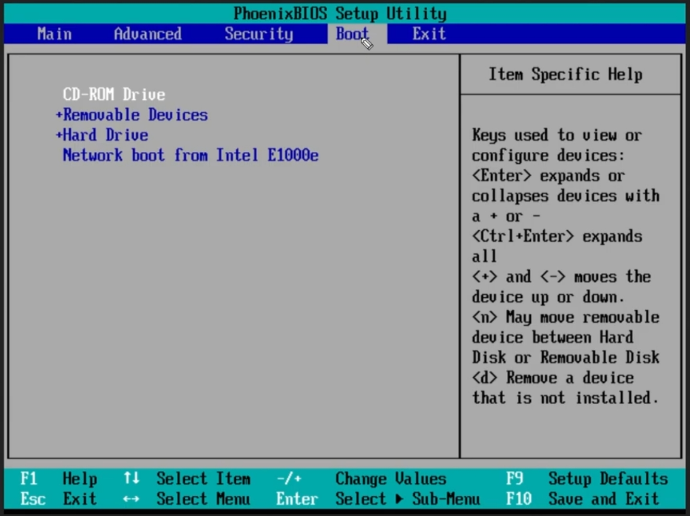
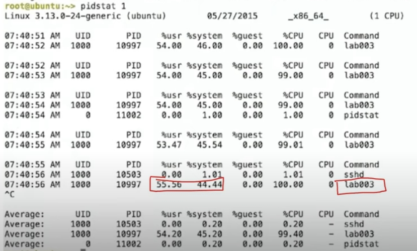
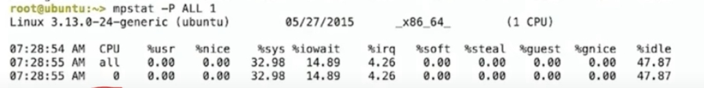
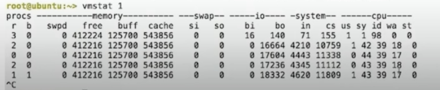
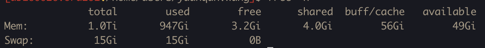
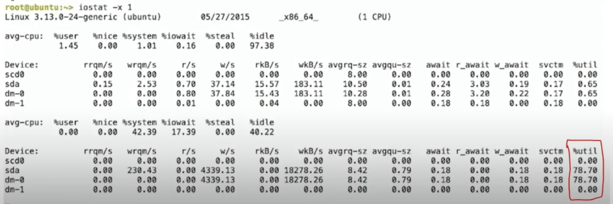

### Linux Command

* tree -d
* cat -N \<file>
* less -N \<file>
* head -n 20 \<file>
* tail -n 15 \<file>
* rmdir \<folder> foler needs to be empty
    * rmdir -v \<folder> verbose
    * rmdir -p \<foler/foler> remove nested folder if all empty
* rm -rf \<foler> to remove all the content, -f option to force deletion without prompting, even for write-protected files.
* mv
* wildcards
    * ls ba?.out
    * ls \*.out
* ip route: display the routing table
* lsblk: list the block devices
* lsof: list open files

### Linux Boot process

* Power button pushed
* BIOS(Basic Input/Output System) run from ROM on motherboard -> POST(Power-on selft test) to test the hardware HDD/SSD, keyboard etc, until this part it's indepent from OS. BIOS is used to boot the Operation System.
* **MBR(Master Boot Record)**
    * Boot order, BIOS loads the OS's MBR, the first sector of drive, only 512 bytes
    
* Boot loader - lilo/ more morden one is grub(grand unified bootloader)
    * Grub runs on RAM, not like lilo only for linux system, grub can boot other operational systems
    * dual boot, for example ubuntu and windows, splash screen
    1. locate the os kernel on the disk
    2. load kernel into RAM
    3. run the kernel code
* Kernel initialization
    * kernel is the **core** of the operating system, total control of operating system
* Kernel loading
    * take over the control of computer resources and initiating all the background processes.
    * kernel is gonna load the systemd, before systemd, it's sysVinit
    * systemd is the parent process of all other processes
* The systemd starts the System services, such as networking services, printing services
* After the user login, the OS loads the desktop environment

### Linux troubleshoot

* application is slow
    * application uses CPUs  -> check CPU usage, and CPU uses memory(RAM) to access data quickly  -> check memory usage and if swap is used  -> next is to check Disk IO  -> next to check the network

* df
* du -sch *: s - summary, c - total disk usage, h - human readable
* ps aux
    * a: Displays information about processes from all users.
    * u: Provides a user-oriented format, showing detailed information about the processes.
    * x: Lists processes without a controlling terminal, typically those started at boot time and running in the background.

* Linux Performance Analysis in 60,000 Milliseconds
    * https://netflixtechblog.com/linux-performance-analysis-in-60-000-milliseconds-accc10403c55

* top to check the overall useage, it provides a dynamic real-time view of a running system. **shift + M** will display the processes in descending oider of memory used. *Default is sorted in CPU*

##### CPU

* uptime: The current time, how long the system has been running, how many user are currently logged on, and the system load averages for the past 1, 5, and 15 minutes.

* pidstat 1
    * is used for monitoring individual tasks currently being managed by the Linux kernel. CPU
    * 

* mpstat -P ALL 1
    * CPU balance
    * -P ALL: list all the cpus, *all* is the global average
    * 
    * 0 means the first cpu core

##### Memory

* vmstat 1
    * report virtual memory statistics
    * 
    * r -> fine if smaller than the number of cpus

* free -h
    * 
        * What is Swap?
            * Emergency memory when all memory exhausted
            * It exists on the disk/storage, so it's very slow

##### disk io

* iostat -xz 1
    * great to check the block devices
    * -x: display extended statistics
    * -z: omit output for any devices for which there was no activity during the sameple period
    * 

