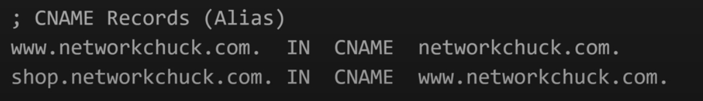

### Network troubleshoot

* ping

* traceroute

### default port

* Web (HTTP): Port 80
* Web (HTTPS - secure): Port 443
* File Transfer Protocol (FTP): Port 21
* Secure Shell (SSH): Port 22
* Simple Mail Transfer Protocol (SMTP): Port 25
* Post Office Protocol (POP3): Port 110
* Interactive Mail Access Protocol (IMAP): Port 143
* Remote Desktop Protocol (RDP): Port 3389
* Database (SQL Server): Port 1433 

### When typing a url and hit enter
* 

#### DNS record explained
* A records - **Domain name -> IP address**

* Name Servers - **second level domain -> responsible Authoritative DNS server**

* AAAA Records - **Domain name -> IP address**

* Mail Server  - **tells email server where to send your messages for your domain**

* PTR Record - **security purpose, check the correct ip address with domain name**

* CNAME Record - **Alias -> Real**

### Network model

* Application layer
    * DNS - protocol
    * DHCP - protocol
    * HTTP - protocol

=========================================
* Transport layer
    * TCP/UDP - protocol
    * port addresses
        * src/des are used for services replications

* Network layer
    * IP - protocol
        * src/des are used to identify the devices on the network
        * how to get the ip address - linux/macOs: ifconfig; windows: ipconfig
    * NAT (for IPv4 lack) - network address translation, able to use 1 public ip address per home/company, within them, use private ip address for different address

* Data link layer - abstractions that convert bytes to human-read/hear/touch

=========================================
* Physical layer
    * Ethernet - protocol
        * src/des are burned in the interface card that can't be changed

### IP Addressing

### Routing protocols

**What is Routing?**
* Definition: Routing is the process of moving data across networks.
* How Routers Work:
    * Routing table: Stores informtaion on network paths
    * Path Selection: Routers choose the best route
* Analogy: Like using GPS to choose the route.

**Why is Routing important?**
* Networks grow, and efficient routing helps manage more users
* Reliability: Ensure the data reaches its destination even it fails due to congestion/maintenance.
* Scalability: Supports growth as network expands

**Static vs. Dynamic Routing**

* static routing: manually configured paths
    * Advan: Simple setup, useful for samll networks
    * Disadvan: Doesn't adapt to networks changes
* dynamic routing: automatically updates paths based on network changes
    * Advan: Adaptable and scalable
    * Disadvan: More complex to configure

* Analogy: Dynamic routing adapts like a GPS that reroutes you based on traffic

#### Dynamic routing protocols

#### RIP (Routing Information Protocol)
* A distance-vector protocol
    * **Hop Count**: Measures the number of routers a packet passes through
* Simple but limited: Best for small networks
    * limit
        * max 15 hops, beyond that considered unreachable to avoid routing loop
        * only consider hop counts, doesn't consider congestion/link speed

* **How RIP works**
    * Routing table updates: Routers share their information every 30 secs
        * Distance vector: Each router only knows its immediate neighbour's routes
    * Tip: RIP is like asking your neighbours about nearby places rather than getting directions for distant locations

* RIP versions
    * RIP v1: Classful routing (**does not** support subnetting, lacks flexibility)
    * RIP v2: Classless routing (support subnetting)
        * support authentication
    * RIP v2 is more morden, allowing better flexity and security

* RIP in Real life
    * Use case: small office or home networks
    * Example: A small business with fewer than 15 routers
    * Tip: RIP works when your network does not grow much

#### OSPF (Open Shortest Path First)
* Link-State Protocol: Consider the state of network links
    * Cost metric: Based on link speed, not just the number of hops
* Hierarchical Design: Divides networks into areas ofr efficiency
    * Area 0 (Backbone): The core area where all other areas connect

* **How OSPF works**
    * LSAs (Link-State Advertisements): Routers share information about their links
        * Link-State Database: All routers in an area build the same map of the network
    * Shortest Path Calculation: Use Dijkstra's algorithm
        * Cost Metric: Path selection based on the speed and reliability of links
    * Tip: OSPF updates quickly, meaning it can reroute data in case of outages

* OSPF Areas
    * Area 0 (Backbone): Central to all OSPF networks
        * Purpose: Ensure efficient routing across multiple areas
    * Other Areas: Divides large networks for better management
        * Area Border Routers (ABR): Connects different areas to the backbone
    * Advan: Minimize the routing table and improve the efficiency
    * Tip: Areas in OSPF work like neighbourhoods connecting to a city center

* OSPF in Real life
    * Use case: Large enterprise networks or ISPs
        * Why use?: Scalable, fast convergence, handles complex network topologies
    * Example: A large company with multiple regional offices
    * Advan: Reliable and fast adapation to network changes
    * Tip: OSPF is ideal when company's network grows and needs fast response to changes

#### BGP (Borer Gateway Protocol)

* Path-Vector Protocol: Routes between autonomous systems (AS)
    * What is AS?: A large network or collection of networks under a common policy
    * Tip: BGP is like a set of rules that ISPs use to direct traffic across the world

* **How BGP works**
    * AS-Path Attribute: Tracks the ASes a route has passed through
        * Shortest AS-Path: The route with fewer ASes is preferred
    * Next-Hop Attribute: The next router that packets should be sent to
    * **Policy-Based Routing**: BGP allows organizations to control how traffic flows based on business policies
    * Tip: BGP uses different rules to ensure traffic flows the way ISPs want it

    * MED (Multi-Exit Discriminator): Helps influnce which path to choose when there are multiple exit points from an AS

* BGP in Real life
    * Use case: ISPs, large enterprises, or global networks
        * Why use?: Flexibility in managing global traffic and control over routing policies
    * Example: Internet traffic routing between two ISPs
    * Tip: BGP is the protocol used to make the internet work across the globe