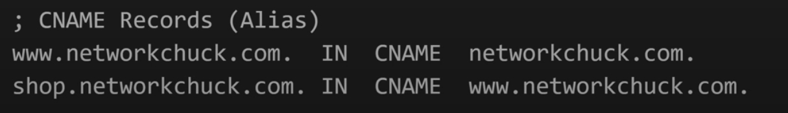

## SRE preparation link
https://github.com/mxssl/sre-interview-prep-guide

### Linux Command

* tree -d
* cat -N \<file>
* less -N \<file>
* head -n 20 \<file>
* tail -n 15 \<file>
* rmdir \<folder> foler needs to be empty
* rmdir -v \<folder> verbose
* rmdir -p \<foler/foler> remove nested folder if all empty
* rm -rf \<foler> to remove all the content, -f option to force deletion without prompting, even for write-protected files.
* mv
* wildcards
    * ls ba?.out
    * ls \*.out
* du -sch *: s - summary, c - total disk usage, h - human readable
* top
* sar -u 4 5: 5 times with 4 secs each
* ps aux
    * a: Displays information about processes from all users.
    * u: Provides a user-oriented format, showing detailed information about the processes.
    * x: Lists processes without a controlling terminal, typically those started at boot time and running in the background.

### Linux Boot process

* Power supply initialization - at this stage, the components receive stable power to operate correctly, e.g. motherboard, CPU, GPU, cooling fans.
* BIOS/UEFI startup and POST - BIOS/UEFI is responsible for POST, error handling, and hardware initialization. POST: Power-on self test to check hardware components working correctly.
* Boot loader - the job of boot loader is to load the actual operating system kernel into memory. 
    * OS kernel - is responsible for managing the system's resources and facilitating communication between hardware and software components.
* Kernel and Init process - so that it can perform tasks, such as managing CPU, memory, and hardware devices; initializing system drivers; preparing user space.
* Starting system services and daemons - such as networking services, printing services, security services.
* User login and Desktop Environment - this gives the user a graphical interface to interact with applications and the underlying hardware.

### Network

When typing a url and hit enter
* 

#### DNS record explained
* A records - **Domain name -> IP address**

* Name Servers - **second level domain -> responsible Authoritative DNS server**

* AAAA Records - **Domain name -> IP address**

* Mail Server  - **tells email server where to send your messages for your domain**

* PTR Record - **security purpose, check the correct ip address with domain name**

* CNAME Record - **Alias -> Real**
