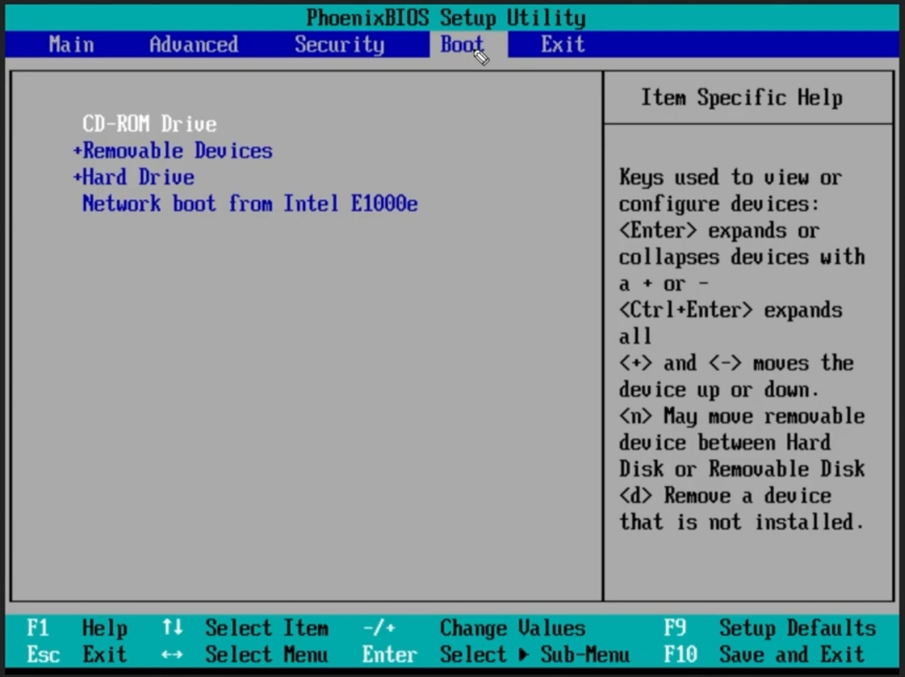

## SRE preparation link
https://github.com/mxssl/sre-interview-prep-guide

### Linux Command

* tree -d
* cat -N \<file>
* less -N \<file>
* head -n 20 \<file>
* tail -n 15 \<file>
* rmdir \<folder> foler needs to be empty
* rmdir -v \<folder> verbose
* rmdir -p \<foler/foler> remove nested folder if all empty
* rm -rf \<foler> to remove all the content, -f option to force deletion without prompting, even for write-protected files.
* mv
* wildcards
    * ls ba?.out
    * ls \*.out
* du -sch *: s - summary, c - total disk usage, h - human readable
* top
* sar -u 4 5: 5 times with 4 secs each
* ps aux
    * a: Displays information about processes from all users.
    * u: Provides a user-oriented format, showing detailed information about the processes.
    * x: Lists processes without a controlling terminal, typically those started at boot time and running in the background.

### Linux Boot process

* Power button pushed
* BIOS(Basic Input/Output System) run from ROM on motherboard -> POST(Power-on selft test) to test the hardware HDD/SSD, keyboard etc, until this part it's indepent from OS. BIOS is used to boot the Operation System.
* **MBR(Master Boot Record)**
    * Boot order, BIOS loads the OS's MBR, the first sector of drive, only 512 bytes
    
* Boot loader - lilo/ more morden one is grub(grand unified bootloader)
    * Grub runs on RAM, not like lilo only for linux system, grub can boot other operational systems
    * dual boot, for example ubuntu and windows, splash screen
    1. locate the os kernel on the disk
    2. load kernel into RAM
    3. run the kernel code
* Kernel initialization
    * kernel is the **core** of the operating system, total control of operating system
* Kernel loading
    * take over the control of computer resources and initiating all the background processes.
    * kernel is gonna load the systemd, before systemd, it's sysVinit
    * systemd is the parent process of all other processes
* The systemd starts the System services, such as networking services, printing services
* After the user login, the OS loads the desktop environment

### Network

* Web (HTTP): Port 80
* Web (HTTPS - secure): Port 443
* File Transfer Protocol (FTP): Port 21
* Secure Shell (SSH): Port 22
* Simple Mail Transfer Protocol (SMTP): Port 25
* Post Office Protocol (POP3): Port 110
* Interactive Mail Access Protocol (IMAP): Port 143
* Remote Desktop Protocol (RDP): Port 3389
* Database (SQL Server): Port 1433 

When typing a url and hit enter
* 

#### DNS record explained
* A records - **Domain name -> IP address**

* Name Servers - **second level domain -> responsible Authoritative DNS server**

* AAAA Records - **Domain name -> IP address**

* Mail Server  - **tells email server where to send your messages for your domain**

* PTR Record - **security purpose, check the correct ip address with domain name**

* CNAME Record - **Alias -> Real**

#### Network model

* Application layer
    * DNS - protocol
    * DHCP - protocol
    * HTTP - protocol

=========================================
* Transport layer
    * TCP/UDP - protocol
    * port addresses
        * src/des are used for services replications

* Network layer
    * IP - protocol
        * src/des are used to identify the devices on the network
        * how to get the ip address - linux/macOs: ifconfig; windows: ipconfig
    * NAT (for IPv4 lack) - network address translation, able to use 1 public ip address per home/company, within them, use private ip address for different address

* Data link layer - abstractions that convert bytes to human-read/hear/touch

=========================================
* Physical layer
    * Ethernet - protocol
        * src/des are burned in the interface card that can't be changed

#### Routing protocols

